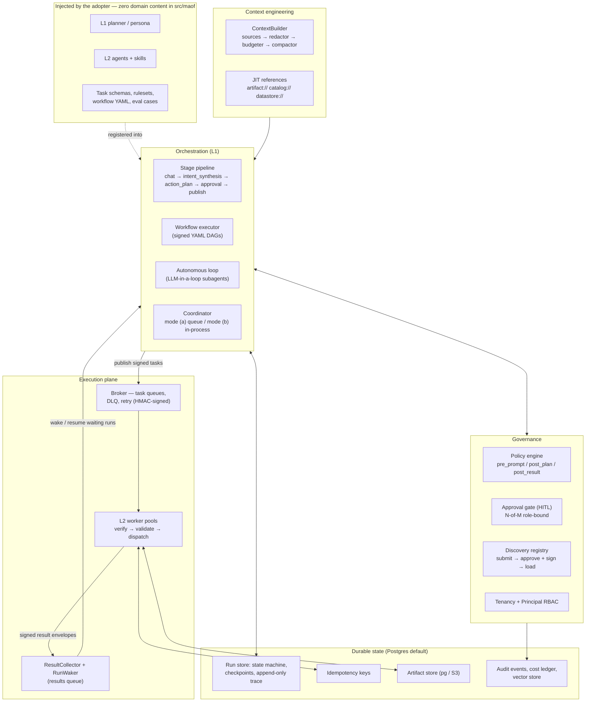
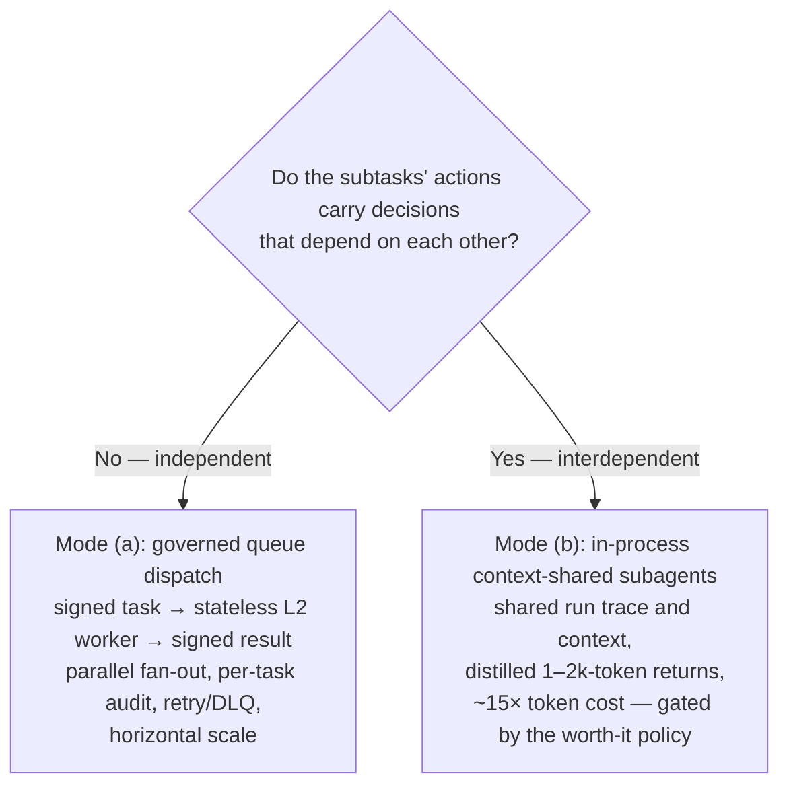
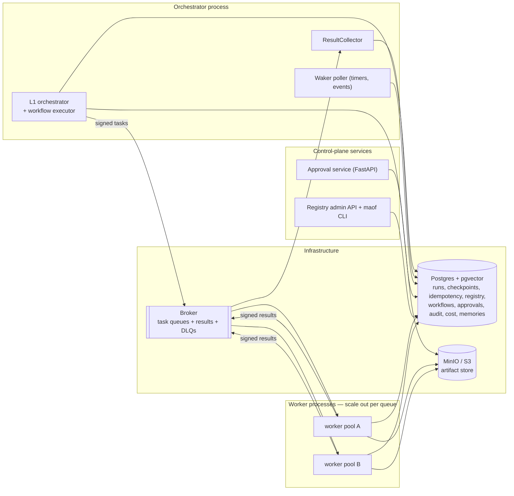
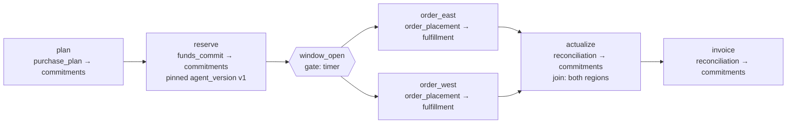
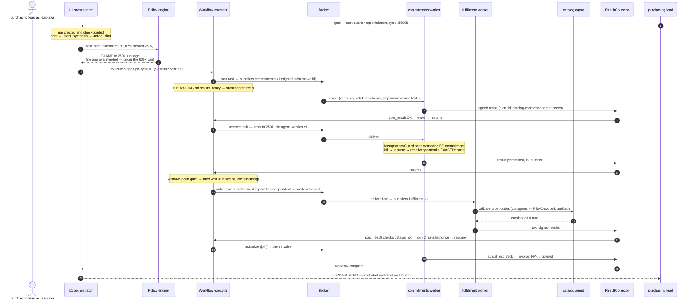

# MAOF Architecture Overview

**Audience:** solutions and enterprise architects evaluating or integrating MAOF. This document explains how the framework is put together, then walks the reference scenario (a real money-moving purchase-order lifecycle) through every layer. It assumes no prior reading.

---

## 1. What MAOF is

MAOF (Multi-Agent Orchestration Framework) is a reusable, installable Python library that provides the **orchestration and governance layer** of a hierarchical multi-agent system: one strategic L1 orchestrator delegating governed tasks to specialist L2 agents. It is the machinery between "an executive states a goal" and "vendor systems execute it safely": planning stages, policy enforcement, human approvals, durable execution, message transport, context management, audit, and cost control.

The defining constraint: **MAOF ships zero domain content.** Every L1 persona, L2 agent, skill, task schema, policy ruleset, and prompt is injected by the adopter as code and configuration. The framework owns only the machinery:

| MAOF owns | The adopter injects |
|---|---|
| The L1 stage pipeline, autonomous orchestrator-loop, and signed-workflow executor | The L1 planner/persona and the choice of execution mode |
| Both coordination modes (governed queue dispatch; in-process context-shared subagents) | The L2 agents, their skills, and which mode each task uses |
| Policy engine, HITL approvals, RBAC, tenancy, identity, signing, audit | The rulesets, approval routing, and tenant/principal sources |
| Durable runs: checkpoints, resume, idempotency, artifact store | Backend choices (Postgres/S3 defaults provided) |
| Context engineering: token budgeting, compaction, notes, just-in-time retrieval | Domain context sources and tuning thresholds |
| Schema registry, message envelopes, transport, DLQ/retry | The concrete task schemas and broker topology |
| Discovery registry for third-party agents/MCP servers (signed, admin-gated) | Which agents to approve |
| Observability (OTel, event sinks, trajectory capture), cost ledger, eval harness | Collectors/dashboards, budgets, eval cases |

The proof of the abstraction is [`examples/po_demo`](../examples/po_demo): the reference scenario runs end-to-end with **zero edits to `src/maof`**.

### The five postures behind every design decision

1. **Parallelize only what is independent.** When subtasks carry decisions that depend on each other, their context and trace must stay unified. This single rule decides queue dispatch vs. shared-context subagents.
2. **Context is the scarce resource.** Token budgeting, compaction, and reference-passing are functional components, not afterthoughts.
3. **Durability is designed in, not bolted on.** Every run checkpoints and resumes; every side effect carries a deterministic idempotency key so replay never double-fires.
4. **Determinism is a data artifact.** LLM plans vary; signed YAML workflow definitions pin the shape of execution for dollar-bearing chains.
5. **Governance is never weakened to add a capability.** New features layer underneath policy, signing, RBAC, and audit, never around them.

---

## 2. Architecture at a glance



Reading the diagram as five planes:

- **Orchestration (L1).** Three interchangeable drivers share the same run identity, durability, policy, and observability: a governed stage pipeline (the default), a signed-workflow executor for repeatable DAGs, and an autonomous LLM-in-a-loop for open-ended work. A `Coordinator` picks, per delegation, between the two coordination modes.
- **Governance.** Policy hooks fire before prompting, after planning, and after results return. Approvals support N-of-M role-bound parties and fail closed. Two registries establish trust: an in-process runtime registry for locally injected agents, and a persisted, admin-gated, **signed** discovery registry for third-party agents and MCP servers.
- **Context engineering.** A `ContextBuilder` assembles each prompt envelope from pluggable sources, then applies a real PII redactor and token budgeter, compacting when over budget. Large data travels as references resolved just in time, never inlined.
- **Execution plane.** Coordination mode (a): schema-validated, HMAC-signed task messages flow to stateless L2 worker pools over a pluggable broker (RabbitMQ default; Kafka, Redis Streams, SQS, in-memory). Dispatch is never fire-and-forget: every task produces a signed result envelope consumed by a `ResultCollector` that validates it and wakes the waiting run.
- **Durable state.** Every orchestration is a run with a persisted state machine, per-step checkpoints, an append-only trace, deterministic idempotency keys, and an artifact store. Postgres (+pgvector) is the default backend for all of it; every repository is an interface.

---

## 3. The execution model: runs and the three drivers

### 3.1 Everything is a run

Every orchestration (pipeline, workflow, or loop) is a **run**: a durable state machine (`pending → running → … → completed | failed | cancelled`, with `waiting` and `awaiting_approval` in between) persisted in the run store with an append-only trace. The framework checkpoints after every stage, workflow step, and loop iteration. On restart it **resumes from the last checkpoint, and completed work is never re-executed** (the durability section below explains why re-delivery is still safe even mid-step). Runs are operable from outside: `maof runs list | show | trace | cancel | resume | wake | promote` (`promote` derives a reusable signed workflow from a successful run — see Workflow-as-data).

### 3.2 The default stage pipeline

The governed default is an ordered, pluggable pipeline:

```
chat → intent_synthesis → action_plan → approval → publish
```

- **chat** seeds the dialogue with the goal; **intent_synthesis** assigns an `intent_id` and distills the goal into task types.
- **action_plan** is where everything converges: the `ContextBuilder` assembles the context envelope, the policy engine runs its pre-prompt hook, the **adopter-injected planner** produces a plan, and the post-plan hook mutates or blocks it (clamp values, strip tools, require approval, deny).
- **approval** blocks on the HITL gate when policy demanded it, failing closed if no gate is available.
- **publish** validates each task against its registered JSON schema, stamps the deterministic idempotency key, signs the message, and dispatches.

The pipeline is a first-class object: stages can be inserted, replaced, or removed (`Pipeline.insert_before / replace`), which is exactly how workflow-as-data plugs in.

### 3.3 Workflow-as-data: signed YAML DAGs

For repeatable, dollar-bearing chains, the plan itself becomes **data, not prompts**: a versioned `WorkflowDefinition`, a YAML DAG with dependencies, parallel fan-out, joins, gates (timers/events), per-step approvals, per-step coordination mode, and agent/model **version pins**. Step inputs are templates over context and prior step outputs (`{{ steps.plan.output.plan_id }}`).

Definitions pass the same trust lifecycle as registry entries: **submit → approve (operator signs the canonical bytes) → load**, and revocation destroys the signature. An unsigned, tampered, or revoked definition never executes. The `WorkflowExecutor` runs the DAG on the result path (dispatching all ready steps, waiting on joins, checkpointing per step), typically installed as a `WorkflowStage` in place of plain publish. The L1's intelligence still chooses and parameterizes the workflow; the signed definition constrains what actually fires.

### 3.4 The autonomous loop

For genuinely open-ended tasks, `OrchestratorLoop` runs an LLM-in-a-loop lead agent that plans, spawns subagents, collects distilled results, and decides whether to continue. It is bounded twice: by an `EffortBudget` and by the **worth-it gate**, a policy check fed by the cost ledger that can deny, require approval, or cap subagent count when projected cost or fan-out exceeds thresholds (multi-agent fan-out costs roughly 15× a single chat).

Every L1→subagent or L1→L2 handoff, in any driver, carries a **`DelegationContract`**: objective, expected output format, tool guidance, explicit boundaries, an effort budget, and a *reference* into the parent trace. This is the concrete defense against subagents acting on conflicting implicit assumptions. Subagents return distilled ~1–2k-token summaries plus artifact references, never raw transcripts.

| Driver | Use when | Character |
|---|---|---|
| Stage pipeline | Day-to-day governed planning | Predictable, auditable, the default |
| Signed workflow | Repeatable chains where money or spend-policy moves | Deterministic shape, operator-signed |
| Autonomous loop | Open-ended exploration where the path can't be predicted | Bounded by effort budget + worth-it gate |

---

## 4. The two coordination modes, and the rule for choosing

The single most important rule in the framework:

> **Parallelize across agents only when subtasks are genuinely independent. Whenever actions carry decisions that depend on each other, the context and trace must stay unified.**



- **Mode (a): governed async queue dispatch.** Independent, separately governable tasks (fan-out per region, parallel research, read-heavy collection) are published as signed, schema-valid messages to L2 worker queues. You get uniform retry/DLQ semantics, per-task signatures and audit, and stateless horizontal scaling. What you give up is the orchestrator's reasoning trace, which is precisely why this mode is *only* for independent work.
- **Mode (b): in-process context-shared subagents.** Interdependent steps (reconciliation, optimization, anything where step N's decision constrains step N+1) run in-process with the full shared trace, returning distilled summaries.

The `Coordinator` applies this per delegation; workflow steps can pin `coordination_mode` explicitly. The anti-pattern the framework actively defends against: **using the queue as a substitute for context sharing.** A deeper treatment with examples lives in [`docs/coordination-modes.md`](coordination-modes.md).

---

## 5. Durability and exactly-once side effects

This is the layer that makes MAOF safe for actions that move money.

**Checkpoints and resume.** The driver checkpoints the full stage context after every stage/step/iteration. `resume_run(run_id)` restores the last good checkpoint and skips completed work. Long-lived runs don't hold processes open: a step that must wait raises `NeedsWait` with a `WakeCondition` (`results_ready`, a join on N results for a step; `timer`, an RFC3339 wake time; or `external_event`, an opaque key such as a shipment approval), and the run checkpoints into `WAITING`, costing nothing until the `RunWaker` resumes it.

**Deterministic idempotency.** Every side-effecting task carries a first-class idempotency key:

```
idempotency_key = sha256(run_id, step_ref, task_type, canonical(task_body))
```

where `step_ref` is the stable logical step identity (`reserve:0`, the workflow step id plus fan-out index). The key is used as the broker `message_id`, so a replayed publish is the *same message*, and consumers dedupe on it: a task whose key has already been committed is acknowledged and skipped. Inside the worker, every external write is wrapped in `IdempotencyGuard.once(key, fn)`: on replay it returns the prior result instead of re-executing. Two independent layers, one guarantee: **a resumed or redelivered run never double-fires a side effect.**

**The result path.** Dispatch is never fire-and-forget. After handling a task, the worker publishes a signed **result envelope** (`message_id = "result:" + idempotency_key`) to the results queue. The `ResultCollector` verifies the signature, dedupes, persists the result, runs **post-result governance** (policy hook + result-schema validation), satisfies any `results_ready` wait, and wakes the run. This closed loop is what lets a workflow say "place the orders *with the reservation IDs from the reserve step*" across a gap of days.

**Cancellation** is the financial kill-switch: cooperative, checked at every stage boundary, loop iteration, and **by workers before each side effect**. A cancelled run finishes its current atomic action and transitions to `CANCELLED`, with no further side effects.

**Artifacts, not payloads.** Large outputs go to the `ArtifactStore` (Postgres or S3/MinIO) and travel as references; trace, audit, and idempotency tables are bounded by a retention/pruning job (`maof prune`).

---

## 6. Governance

Governance is layered, and every layer fails closed.

**Policy-as-code.** The native policy engine evaluates versioned rulesets at three hooks: `pre_prompt` (before the planner sees context), `post_plan` (over the produced plan), and `post_result` (over results returning from workers, before dependent steps can consume them). Rules are a JSON condition DSL (`gt`, `eq`, `and`, … over flags, intent, plan, toolset, semantic paths) or plain Python callables. The action set is complete rather than advisory: `set_flag`, `add_nudge`, `require_approval`, `deny_plan`, `strip_tool`, `strip_task_type`, and a generalized **clamp/mutate** that rewrites plan values to policy-compliant ones. Rulesets are versioned and canary-able (deterministic per-run cohorts). Every decision (matched rules, actions, stage, version) is audited.

**Approvals.** The HITL gate is built in and toggleable. Policy can demand **N-of-M role-bound multi-party approval**: N distinct principals whose roles match must approve; any role-matching denial fails it; every resolution is attributed and audited; expiry fails closed. When a plan requires approval and no gate is available, the default is `approval_fallback=deny`.

**A tenant is not an actor.** Tenant isolation threads through every interface, but within a tenant a `Principal` (`id`, `kind`, `org`, `roles`, `scopes`) is threaded through the stage context, the task envelope's `actor` field, audit events, run records, and approval attributions. RBAC reads principal scopes first (tenant scopes as fallback), and workers **strip unauthorized tools at dispatch** before the agent ever sees them. Operator actions are scope-gated too — `runs:read` for run reads, `workflow:author`/`workflow:approve` for promoting and signing — with identity resolved bring-your-own (env `PRINCIPAL_*` or an injectable resolver; single-tenant trusts the local operator, multi-tenant fails closed).

**Trust is a signature, not a status flag.** Three things share the same lifecycle (third-party agent manifests, MCP server entries, and workflow definitions): *submit* (pending) → *approve* (operator signs canonical bytes; HMAC by default, Ed25519 optional) → *load* (only approved **and** signature-valid entries are visible) → *revoke* (destroys the signature). Tampering is not detected at audit time; it makes the entry invisible to the loader. Task messages and result envelopes are HMAC-signed with key-id rotation; workers verify before handling.

**Audit and observability.** A structured `EventSink` interface (Postgres and stdout sinks shipped) receives every domain event: `run_started`, `policy_decision`, `approval_requested/granted/denied`, `publish`, `subresult_received`, `run_waiting`, `run_resumed`, `agent_consulted`, `context_delegated`, `registry_approved`, `run_completed`, and the rest of the lifecycle vocabulary. OpenTelemetry spans wrap stages, workflow steps, dispatch, and consumption (no-op when unconfigured). Trajectory capture records *decision patterns and interaction structure* (how delegations branched, where retries happened) without conversation content, so non-deterministic runs stay debuggable without leaking data. Prompts are audited redacted.

---

## 7. Context engineering

LLM accuracy degrades as the context window fills, so MAOF treats context as a budgeted resource:

- **The builder chain.** `ContextBuilder` runs pluggable `ContextSource`s (policy flags, semantic model, stage-aware tool registry, data pointers, vector-recalled memories, plus anything registry-attached), then a **functional redactor** (real PII removal under policy) and a **real token budgeter** that trims to budget and triggers compaction when over.
- **Three memory strategies.** *Compaction* summarizes a near-full window into a digest that preserves decisions, plans, and open issues. *Structured note-taking* persists durable notes outside the window that agents re-read on demand. *Vector recall* (pgvector default) is one source among the three, not "the memory system."
- **References over inlining.** Large data lives in the artifact store and travels as `artifact://` references; registry agents can declare their own JIT schemes (`catalog://`, `datastore://`) that plug into the `ReferenceResolver`. Content loads on demand, never pre-stuffed.
- **Declared context delegation.** Specialist agents often side-load their own context (vendor mappings, rate cards, validation rulesets). MAOF supports this as a first-class pattern with one obligation: the agent **declares** it (`ContextDeclaration`: what it supplies, what it still requires from L1, provenance, mutability). The L1 then de-duplicates what it assembles, verifies the agent's requirements are met before routing, stamps `delegated_context` into the envelope, and emits a `context_delegated` audit event. An undeclared side-load is treated as a trust violation, and policy can deny or gate declared ones.

---

## 8. The integration surface

### 8.1 Agents

First-party agents implement small Python contracts (`L1Orchestrator`; `L2Agent`, with a name, accepted task types, skills, context declarations, and one `handle()` method; and `Skill`), registered via decorators (`@register_l2_agent`) or packaging entry points. A built-in **MCP adapter** wraps any remote MCP server so it satisfies the same `L2Agent` or `ContextSource` contract; discovery-registry entries align with **A2A Agent Cards** for cross-organization interop (import an approved card into the registry; export MAOF agents as cards). MCP is the tool/context protocol; A2A is the cross-org agent protocol; both pass through the same signed trust lifecycle.

### 8.2 The discovery registry and registry intelligence

The discovery registry is the persisted, admin-gated catalog of third-party capability. A manifest declares what an agent is (`l2_agent`, `mcp_server`, or `context_source`), what it accepts and produces, the RBAC scopes required to invoke it, its queue binding, any JIT resolver schemes it serves, and its side-loaded context. On top of the trust lifecycle, the registry is *intelligent*:

- **Semantic capability search.** Approved manifest descriptions are embedded, so a planner can find "an agent that can tune in-flight the east region pacing" by meaning, not by id.
- **Certification-gated approval.** A manifest can name an eval dataset and minimum pass rate; an agent that flunks its certification suite cannot be approved, full stop.
- **Registry-driven routing.** Tasks route to the manifest's declared queue (naming-convention fallback), with workflow **version pins** enforced at routing and deterministic per-run **canary cohorts** per entry version.

### 8.3 Hosting source-of-truth agents

Domain truth services (a naming catalog, a shared datastore) are *ordinary registry agents*; the framework supplies the hosting machinery that makes them actually authoritative:

1. **Every planner sees them.** Approved `context_source` entries auto-attach to the `ContextBuilder` (RBAC/tenant-gated, cached per declared mutability). A source marked `required` **fails the run closed** when unavailable.
2. **Every agent can ask them.** `ctx.agents.client("<agent-id>")` returns a registry-resolved, RBAC-scoped MCP client for mid-task consultation; every consultation emits an `agent_consulted` audit event.
3. **Nothing non-conformant survives.** The `post_result` policy hook plus result-schema validation run on the collector path and can deny a violating result before any dependent step consumes it.

Hosted, consulted, *and enforced*: convention-based conformance decays the day the first vendor agent skips the lookup, so enforcement lives in the framework while content lives in the agent.

### 8.4 Providers and transports

| Surface | Shipped adapters | Bring your own |
|---|---|---|
| LLM / embeddings | Anthropic, OpenAI, Azure OpenAI, AWS Bedrock, Google Gemini/Vertex, Mistral, Cohere, Ollama (offline default), LiteLLM-style gateway | `LLMProvider` / `EmbeddingProvider` protocols |
| Broker | RabbitMQ (default), Kafka, Redis Streams, AWS SQS, in-memory | `Broker` protocol |
| State / vectors | Postgres + pgvector, in-memory | Repository protocols, `VectorStore` |
| Artifacts | Postgres, S3/MinIO, in-memory | `ArtifactStore` protocol |

Task bodies validate against adopter-registered JSON Schemas; the framework ships exactly one built-in (`generic_task.v1`). Every LLM call records tokens to the per-run cost ledger that feeds budgets and the worth-it gate, and an evaluation harness (LLM-as-judge rubrics, end-state grading, CI gating via `maof eval run`) closes the quality loop.

---

## 9. Message contracts

Two wire shapes carry everything on the queue path. Condensed (illustrative values from the worked example):

**Task message** (published by L1 at dispatch):

```json
{
  "envelope": {"run_id": "…", "tenant_id": "shared-buyer-001", "stage": "action_plan",
                "ruleset_ref": "spend-cap", "schema_id": "funds_commit.v1",
                "actor": {"id": "lead-ava", "org": "buyer", "roles": ["buyer-lead"]}},
  "task": {"task_id": "…", "task_type": "funds_commit",
            "idempotency_key": "sha256(run_id, step_ref, task_type, canonical(body))",
            "step_ref": "reserve:0", "reply_to": "results"},
  "policy_flags": {"spend_cap_usd": "600000", "disclosed_principal": "true"},
  "toolset": [{"name": "commitments", "scope": "tenant", "rbac": "buy:commit"}],
  "data_pointers": {"rate_card": "datastore://rate-card/east"}
}
```

**Result envelope** (published by the worker after handling):

```json
{
  "run_id": "…", "step_ref": "reserve:0", "task_type": "funds_commit",
  "idempotency_key": "<the task's key>",
  "result": {"status": "ok", "output": {"committed": true, "amount_usd": 250000,
              "io_number": "IO-123"}, "artifacts": [], "error": null}
}
```

Both are HMAC-SHA256 signed (`kid` + `sig` headers, multi-key rotation, constant-time verify). Delivery semantics are transport-agnostic: persistent messages, `message_id = idempotency_key` (results: `"result:" + key`), DLQ + retry-with-backoff implemented uniformly across all broker adapters.

---

## 10. Deployment topology



`docker compose up` brings up the full dev stack (Postgres+pgvector, RabbitMQ, MinIO, orchestrator, workers, approval service, registry admin API) with migrations on startup; everything also runs **embedded**: orchestrator and workers in one process over the in-memory broker (`EMBEDDED_L2=true`), which is how the offline demo and unit tests run. Workers are stateless by design (the *run* holds all state), so they scale horizontally per queue. Because runs span days, deploys are **rainbow/gradual**: old and new orchestrator versions run side by side and in-flight runs drain, and checkpoint/resume plus idempotency keys make handover safe. Operational details: [`docs/deployment.md`](deployment.md).

---

## 11. The reference scenario, end to end

Everything above, exercised at once by [`examples/po_demo`](../examples/po_demo), a pure adopter of the library.

### 11.1 The scenario and the cast

A buyer (brand) and its procurement partner **share one tenant**. The purchasing lead wants the next-quarter replenishment cycle across the east and west regions, executed across two vendor platforms: **Commitments** (planning, buying, billing; the actions that create real financial commitments) and **Fulfillment** (order placement, shipment prep, delivery metrics; execution, not funds-committing).

The governance crux is **the spend-cap policy**: the partner is liable to suppliers only to the extent it has received cleared funds from the buyer, and must never commit beyond client funding. That rule, normally a contract clause enforced by hoping everyone remembers it, is encoded as policy-as-code and enforced by the framework on every plan.

| Cast member | What it is | Registered as |
|---|---|---|
| `shared-buyer-001` | The shared tenant | — |
| `lead-ava` | Buyer purchasing lead (`org=buyer`, role `buyer-lead`) | `Principal`, initiates the run |
| `fin-frank` | Buyer finance (`buyer-finance`) | `Principal`, approval party 1 |
| `ops-omar` | Partner ops (`org=partner`, role `partner-ops`) | `Principal`, approval party 2 |
| `commitments` | Plan / buy / bill agent, **funds-committing** | Registry `l2_agent`, queue `suppliers.commitments.v1`, certification-gated |
| `fulfillment` | Order / ship / measure agent | Registry `l2_agent`, queue `suppliers.fulfillment.v1`, certification-gated |
| `catalog` | Naming-catalog source of truth (v3) | Registry `context_source`, **required**, `catalog://` resolver, MCP validate tool |
| `datastore` | Unified data layer (rate cards, performance) | Registry `context_source`, optional, `datastore://` resolver |
| `optimizer` | In-flight pacing optimizer | Registry entry found by **semantic search** |
| `shady-broker` | A vendor that flunks its eval | **Refused approval** by the certification gate |
| `spend-cap` v4 | The ruleset (4 rules, below) | Policy repo |
| `po-cycle` v1 | The signed workflow | Workflow store (submit → approve + sign) |

The ruleset, in full ([`rules/spend-cap.yaml`](../examples/po_demo/rules/spend-cap.yaml)):

| Rule | Hook | What it does |
|---|---|---|
| `assert-disclosed-principal` | `action_plan` | Always asserts the disclosed-principal posture on the commitment chain |
| `clamp-to-cleared-funds` | `action_plan` | If committed spend > cleared funds, **clamp it down** and nudge the plan |
| `two-party-approval-over-cap` | `action_plan` | If committed spend > spend cap, require approval from **both** `buyer-finance` AND `partner-ops` (parties=2) |
| `deny-nonconformant-placement` | `post_result` | If a vendor result reports `catalog_ok: false`, **deny it** before anything downstream consumes it |

### 11.2 Trust setup (before any run)

1. The five vendor/truth manifests are **submitted** to the discovery registry. Approval runs each agent's **certification** eval first: `commitments` and `fulfillment` pass and are **approved + signed**; `shady-broker` scores 0.25 and is **refused**: it can never be loaded, routed to, or consulted.
2. Approved manifest descriptions are embedded for semantic search; `catalog` and `datastore` auto-attach to the context builder for this tenant; their `catalog://` / `datastore://` schemes register as JIT resolvers.
3. The partner encodes the purchase-order lifecycle once as [`workflows/po-cycle.yaml`](../examples/po_demo/workflows/po-cycle.yaml) and submits it; an operator **approves and signs** it. From now on the chain is data, not prompts.



A representative step, exactly as the partner wrote it (note the template binding to a prior step's output and the version pin):

```yaml
- id: reserve
  task_type: funds_commit
  depends_on: [plan]
  pins: {agent_version: v1}   # refuse a silently swapped vendor version
  input:
    amount: "{{ context.committed_spend_usd }}"   # already clamped by policy
    plan_ref: "{{ steps.plan.output.plan_id }}"
```

### 11.3 The run

The numbers in the shipped demo: the purchasing lead asks for **$500k**; only **$250k** of client funds have cleared; the partner's spend cap is **$600k**.



Beat by beat, with the framework feature each beat exercises:

1. **Goal intake.** `lead-ava` starts the run on tenant `shared-buyer-001`. Her `Principal` rides the stage context and every envelope's `actor` field from here on; `run_started` is the first audit event, and the run is checkpointed before any stage executes.
2. **Planning context.** At `action_plan`, the context builder assembles the envelope. The `catalog` slice is present **automatically** (it's a required, registry-approved context source; if it were down, the run would fail closed rather than plan against stale names). Rate cards arrive as `datastore://rate-card/east` references, resolved just in time, never inlined.
3. **The clamp.** The injected planner proposes $500k of committed spend. `clamp-to-cleared-funds` fires (500k > 250k cleared): the plan's committed spend is **mutated down to $250k** and a nudge records why. `assert-disclosed-principal` stamps the disclosed-principal posture. The `policy_decision` audit event captures matched rules, actions, and ruleset version 4.
4. **The approval that didn't happen.** $250k is under the $600k cap, so `two-party-approval-over-cap` stays quiet and the approval stage passes. (The variant where it fires is covered below.)
5. **The signed workflow takes over.** The `WorkflowStage` loads `po-cycle` v1, but only because its signature verifies. The executor dispatches `plan` to `suppliers.commitments.v1` (the queue from Commitments's signed manifest, i.e. registry-driven routing), and the run checkpoints into `WAITING`. No process is held open.
6. **A governed worker.** The Commitments worker verifies the HMAC signature, validates the body against `purchase_plan.v1`, strips any tool the principal's RBAC doesn't cover, and only then invokes the agent. The result envelope flows back through the `ResultCollector`: signature verified, deduped, result-schema validated, `post_result` policy run, and then the join is satisfied and the run resumes.
7. **The money step.** `reserve` binds its inputs from the *clamped* context and `plan`'s output (`{{ steps.plan.output.plan_id }}`), is pinned to `agent_version: v1` (a swapped vendor version is refused at routing), and lands on Commitments. The worker wraps the PO commitment in `IdempotencyGuard.once`. The ledger entry it writes is the **commitment position**: amount $250k, funds-received basis $250k, `disclosed_principal=true`, parties buyer / procurement partner / vendor.
8. **Kill it mid-commit.** This is the headline durability test (`tests/test_scenario.py`): kill the orchestrator during `reserve`, restart, `resume_run`. Completed stages are skipped from checkpoint; the re-dispatched step carries the **same** `idempotency_key` (`sha256(run_id, "reserve:0", "funds_commit", body)`), so the broker/consumer dedupe it and the guard returns the prior result. **The buy commits exactly once. No double spend.**
9. **The wait.** `window_open` is a timer gate (in production, days until the flight date); the run sleeps as a `WAITING` row, and the waker poller resumes it on schedule (`run_waiting` → `run_resumed` in the audit trail).
10. **Independent fan-out.** `order_east` and `order_west` depend only on the gate, so they dispatch **in parallel**: textbook coordination mode (a), with two independent, separately signed, separately audited vendor tasks.
11. **Consulting the source of truth.** Mid-task, the Fulfillment agent calls `ctx.agents.client("catalog")` (a registry-resolved, RBAC-scoped MCP client) to validate order codes (`PO_EAST_REPLENISH_A` matches the catalog's pattern). Each consultation emits an `agent_consulted` audit event. The result carries `catalog_ok: true`.
12. **Enforced conformance + the join.** On the collector path, `deny-nonconformant-placement` inspects each result. Both pass; the `results_ready` join (expected=2) is satisfied **exactly once**, and the run resumes.
13. **Actualize, then invoice.** `actualize` reconciles actuals against the committed $250k from `reserve`'s output; `invoice` opens the buyer invoice (`INV-…`) for the actualized amount. Both are Commitments `reconciliation` tasks, both idempotency-guarded like every side effect.
14. **Done, and provable.** The run completes with an end-to-end attributed trail: who initiated, what policy clamped and why, which signed workflow ran, which signed manifests executed which steps, what was committed against what funds basis, who was consulted, what was invoiced. The cost ledger holds the run's token spend.

### 11.4 The paths not taken (same run, different inputs)

- **Over the cap → two-party approval.** Had the request been $700k with $700k cleared, `two-party-approval-over-cap` fires: the run blocks in `awaiting_approval` until **both** a principal holding `buyer-finance` (`fin-frank`) *and* one holding `partner-ops` (`ops-omar`) approve. A wrong-role resolution is rejected; one matching denial kills it; a gate timeout, or no gate deployed, **fails closed**. Both sides of the shared tenant must sign before the partner is exposed.
- **A catalog-violating name.** A placement that fails the catalog's validation comes back `catalog_ok: false`; the `post_result` rule **denies the result at the collector**: it is quarantined before `actualize` can ever consume it. Conformance is governance, not convention.
- **Cancel mid-flight.** `maof runs cancel <run_id>` sets the cooperative flag; the workers check it before side effects; the run lands in `CANCELLED` with no further commitments: the financial kill-switch.
- **The vendor that never got in.** `shady-broker` failed its certification eval at approval time. It isn't "approved but risky"; it is unsigned and invisible to routing, planning, and consultation.
- **Picking a vendor by capability.** The planner finds the `optimizer` agent by semantic search over signed manifest descriptions ("tune in-flight the east region pacing and bid strategy"): registry intelligence selecting third-party systems by what they *do*.

### 11.5 What the scenario proves

| Scenario beat | Framework guarantee exercised |
|---|---|
| $500k ask, $250k committed | Policy-as-code with plan **mutation** (clamp), versioned rulesets |
| Over-cap variant | N-of-M role-bound HITL approvals, fail-closed default |
| Kill → resume, one IO | Durable runs, checkpoints, deterministic idempotency keys, exactly-once side effects |
| Flight-start gate | Waits/timers: week-spanning runs that cost nothing while sleeping |
| Parallel order placement | Coordination mode (a) fan-out for independent tasks; joins on the result path |
| Mid-task catalog check | Hosted source-of-truth agents: auto-attached context, RBAC-scoped `ctx.agents` consultation, audited |
| `catalog_ok: false` denial | `post_result` governance: non-conformant results never propagate |
| Signed `po-cycle` v1 | Workflow-as-data: determinism as a signed artifact, version pins |
| `shady-broker` refusal | Certification-gated, signed registry trust |
| `lead-ava` / `fin-frank` / `ops-omar` | Principal identity threaded through envelopes, approvals, audit, commitment-position records |
| Buyer + partner, one tenant | Multi-tenancy with intra-tenant org/role attribution |

### 11.6 Run it yourself

```bash
pip install -e ".[dev]"
python -m examples.po_demo.main     # offline, in-memory — the full scenario in seconds
pytest tests/test_scenario.py -q    # the headline assertions, including exactly-once
```

The demo prints the lifecycle, the spend-policy ledger position, each step's output, the catalog consultations, and the run's audit-event sequence. `examples/po_demo/main_distributed.py` runs the same scenario against real Postgres + RabbitMQ via `docker compose up`.

---

## 12. Where to go next

- [`examples/quickstart`](../examples/quickstart): the smallest governed run — one agent, one task, offline.
- [`README.md`](../README.md): quickstart and the "implementing your own" injection-point table.
- [`docs/QA.md`](QA.md): hands-on QA runbook with tiered local setup and interactive governance drills.
- [`docs/coordination-modes.md`](coordination-modes.md): choosing between queue dispatch and shared-context subagents.
- [`docs/deployment.md`](deployment.md): Docker, embedded mode, run operations, retention, and rainbow deploys.
- [`docs/publishing.md`](publishing.md): building and publishing to PyPI.
